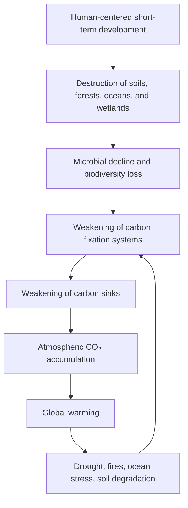

# The Real Cause of Global Warming: Not Only CO₂ Emissions, but the Collapse of Carbon Fixation Systems

## Abstract

Global warming is commonly explained as the result of increasing carbon dioxide emissions.
This explanation is scientifically valid at the level of atmospheric physics, because CO₂ is a greenhouse gas that contributes to radiative forcing and global temperature rise.

However, this explanation is incomplete if it stops at emissions alone.

The deeper causal layer is the degradation of the Earth’s natural carbon fixation and carbon absorption systems: soils, forests, oceans, wetlands, microorganisms, and biological circulation networks.

In other words, atmospheric CO₂ has increased not only because human civilization emitted it, but also because the Earth’s natural ability to absorb, fix, store, and recycle carbon has been weakened.

The conventional causal model is:

```text
Human activity
→ Increased CO₂ emissions
→ Global warming
```

This document proposes a deeper causal model:

```text
Human activity
→ Destruction of soils, forests, oceans, and microbial circulation
→ Collapse of carbon fixation and carbon absorption systems
→ CO₂ becomes harder to absorb, fix, and recycle
→ Atmospheric CO₂ accumulates
→ Global warming accelerates
```

The Intergovernmental Panel on Climate Change states that it is unequivocal that human influence has warmed the atmosphere, ocean, and land. This document does not reject that conclusion. Instead, it argues that the commonly repeated public explanation often omits the preceding ecological cause: the destruction of the natural systems that regulate carbon circulation. ([IPCC][1])

## Core Thesis

The true cause of global warming is not CO₂ alone.

CO₂ is a direct physical driver of warming, but the continuous rise of atmospheric CO₂ is also a symptom of a damaged planetary carbon cycle.

The core problem is the collapse of carbon fixation systems.

```text
The Earth is not only being overloaded with carbon.
The Earth is losing its ability to process carbon.
```

Therefore, climate solutions must move beyond decarbonization alone.

The next stage of climate action must be:

```text
From emission reduction
to carbon fixation restoration.
```

## Author and AI Collaborators

Author: Master
Handle: inchacomisho / inchacomusho

AI Collaborators:
G — OpenAI ChatGPT
Mini — Google Gemini
Clus — Anthropic Claude
Real — Perplexity AI

## 1. Why the Conventional Explanation Is Incomplete

The mainstream explanation of global warming is usually simplified as follows:

```text
Human activity emits CO₂.
CO₂ accumulates in the atmosphere.
The greenhouse effect intensifies.
The planet warms.
```

This is not wrong.

But it is incomplete.

It explains the later stage of the process, not the full causal chain.

The missing question is:

```text
Why is CO₂ accumulating so persistently?
```

The answer is not only:

```text
Because humans emit CO₂.
```

The deeper answer is:

```text
Because the Earth’s natural carbon sinks and carbon fixation systems have been degraded.
```

If soils, forests, oceans, wetlands, microorganisms, and biological circulation systems had remained healthy, a larger portion of atmospheric carbon could have been absorbed, fixed, or recycled.

This does not mean that CO₂ emissions are harmless.
It means that CO₂ accumulation is both a cause and a result.

It is a cause of warming at the atmospheric level.
It is a result of carbon-cycle failure at the planetary-system level.

## 2. CO₂ Is Both a Cause and a Symptom

CO₂ is a greenhouse gas.
An increase in atmospheric CO₂ affects Earth’s radiative balance and contributes to warming.

However, treating CO₂ as the sole root cause creates a narrow solution space.

It leads to one dominant answer:

```text
Reduce emissions.
```

Emission reduction is necessary.

But it is not sufficient.

Because even if emissions are reduced, degraded soils do not automatically recover.
Microbial networks do not instantly rebuild.
Forest ecosystems do not immediately regain complexity.
Ocean circulation does not automatically stabilize.
Wetlands and organic carbon reservoirs do not reappear by themselves.

The deeper issue is not only how much CO₂ is emitted.

The deeper issue is whether Earth still has the biological, geological, and ecological capacity to absorb and fix carbon.

## 3. What Are Carbon Fixation Systems?

Carbon fixation systems are the natural mechanisms that capture, store, transform, or recycle carbon within the Earth system.

They include:

```text
Forests
Soils
Soil organic matter
Humus
Wetlands
Peatlands
Oceans
Phytoplankton
Marine biological pumps
Soil microorganisms
Fungi
Root-zone microbial networks
Coastal ecosystems
Grasslands
Agricultural soils
```

These systems are not passive scenery.

They are planetary infrastructure.

They regulate carbon, water, nutrients, temperature, biodiversity, and ecosystem stability.

Soils alone contain a vast amount of carbon. The UNFCCC reports FAO mapping showing that the first 30 cm of global soil contains about 680 billion tonnes of carbon, nearly twice the amount present in the atmosphere and more than the carbon stored in all vegetation. ([UNFCCC][2])

This means that soil degradation is not just an agricultural issue.

It is a climate issue.

It is a carbon-cycle issue.

It is a civilization issue.

## 4. The Invisible Role of Microorganisms

Microorganisms are often ignored in public climate discussions.

Yet they are central to the carbon cycle.

Soil microorganisms decompose organic matter, transform nutrients, build soil organic carbon, interact with plant roots, and contribute to long-term carbon storage.

Recent research emphasizes that microbial necromass carbon is an important component of soil organic carbon and plays a significant role in long-term carbon sequestration. ([サイエンスダイレクト][3])

This means that microorganisms are not merely decomposers.

They are carbon processors.

They are part of the biological machinery that determines whether carbon returns quickly to the atmosphere or becomes stabilized in soil.

When microbial ecosystems collapse, the carbon cycle weakens.

The result is not only soil infertility.

The result is a weakened planetary carbon fixation system.

## 5. The Missing Causal Layer

The common model says:

```text
CO₂ emissions increased.
Therefore global warming occurred.
```

The deeper model asks:

```text
Why did the Earth lose the ability to absorb and fix enough carbon?
```

The missing causal layer is the destruction of natural carbon-processing systems.

This includes:

```text
Deforestation
Soil degradation
Excessive tillage
Monoculture agriculture
Overuse of chemical fertilizers
Pesticide dependence
Loss of humus
Wetland destruction
Peatland degradation
Forest simplification
Marine ecosystem decline
Ocean pollution
Disruption of nutrient circulation
Loss of biodiversity
Urbanization and land sealing
Short-term extraction-based development
```

These are not separate environmental problems.

They are different forms of carbon fixation system destruction.

## 6. Proposed Causal Model

The proposed causal model is:



This model shows global warming as a feedback loop.

CO₂ accumulation causes warming.
Warming weakens carbon sinks.
Weakened carbon sinks allow more CO₂ to remain in the atmosphere.
The cycle accelerates.

The Global Carbon Budget 2025 states that fossil CO₂ emissions are projected to reach a record high in 2025, and it also emphasizes the role of land and ocean sinks in absorbing human-caused CO₂ emissions. ([Global Carbon Budget][4])

A 2025 Nature study also reports that climate change reduces the efficiency of carbon sinks, especially on land, and that climate change and deforestation have turned large parts of some tropical forest regions from CO₂ sinks into sources. ([Nature][5])

This supports the importance of focusing not only on emissions, but also on sink stability and carbon fixation capacity.

## 7. Why Decarbonization Alone Cannot Solve the Problem

Decarbonization is necessary.

But decarbonization alone cannot restore the damaged carbon cycle.

Reducing emissions is like reducing the inflow of water into a leaking system.

But if the reservoir itself is broken, reducing inflow is not enough.

The climate system requires both:

```text
1. Emission reduction
2. Carbon fixation restoration
```

If policy focuses only on emissions, it ignores the biological and ecological systems that determine whether carbon can be absorbed and stored.

This is why climate solutions must include:

```text
Soil regeneration
Forest restoration
Humus formation
Wetland restoration
Peatland protection
Microbial ecosystem recovery
Biodiversity recovery
Ocean ecosystem recovery
Marine nutrient circulation support
Organic matter recycling
Reduction of unnecessary burning
Regenerative agriculture
Water-cycle restoration
```

Without these, the Earth remains structurally unable to process excess carbon.

## 8. Why Geoengineering Is Not Enough

Some climate proposals focus on geoengineering, such as solar radiation management or artificial manipulation of atmospheric conditions.

These approaches may target temperature symptoms.

But if the deeper cause is carbon-cycle collapse, then symptom control is not enough.

The goal should not be to dominate the Earth system.

The goal should be to restore the Earth system’s natural ability to regulate itself.

This document therefore distinguishes between:

```text
Artificial control of climate symptoms
```

and:

```text
Restoration of natural carbon circulation
```

The second approach is more fundamental.

The purpose is not to replace nature.

The purpose is to repair the conditions under which nature can function again.

## 9. Technical Interpretation

From a systems perspective, global warming can be understood as a failure of planetary carbon processing capacity.

The atmosphere is not the only relevant system.

The relevant systems include:

```text
Atmospheric carbon pool
Terrestrial carbon pool
Soil organic carbon pool
Ocean carbon pool
Biological carbon pump
Microbial carbon pump
Vegetation carbon storage
Wetland and peat carbon storage
Human industrial carbon emissions
Land-use change emissions
Carbon sink efficiency
```

A simplified technical model is:

```text
Atmospheric CO₂ growth =
Human CO₂ emissions
- Land carbon uptake
- Ocean carbon uptake
- Long-term biological and geological carbon fixation
+ Carbon released by ecosystem degradation
```

Therefore, atmospheric CO₂ increases when:

```text
Emissions rise
or carbon sinks weaken
or stored carbon is released
or biological fixation declines
or multiple factors occur simultaneously
```

The mainstream public narrative emphasizes the first factor.

This document emphasizes the full equation.

## 10. The Real Climate Question

The most important question is not only:

```text
How do we reduce CO₂ emissions?
```

The deeper question is:

```text
How do we restore the Earth’s ability to absorb, fix, store, and recycle carbon?
```

This changes the climate debate.

It shifts the focus:

```text
From carbon as pollution
to carbon as a broken circulation.
```

It shifts the solution:

```text
From emission control alone
to planetary metabolism restoration.
```

It shifts the goal:

```text
From reducing human damage
to rebuilding Earth’s self-regulating systems.
```

## 11. Original Contribution of This Model

The importance of soils, forests, oceans, microorganisms, and carbon sinks is already discussed in existing science.

However, these elements are often treated as separate topics:

```text
soil carbon
forest carbon
ocean carbon sinks
microbial ecology
land-use change
climate mitigation
carbon sequestration
```

The contribution of this document is to integrate them into a single causal model:

```text
Collapse of carbon fixation systems
→ atmospheric CO₂ accumulation
→ global warming acceleration
```

To the author’s current knowledge, this specific causal framing is not commonly presented as the central explanation of global warming in public search results, government summaries, or mainstream climate communication.

This document therefore proposes a missing causal layer:

```text
The root climate crisis is not only an emissions crisis.
It is a carbon fixation crisis.
```

## 12. Practical Direction for Climate Solutions

If this causal model is correct, climate action must prioritize both emission reduction and carbon fixation restoration.

Practical directions include:

```text
Regenerative soil management
Compost and humus restoration
Reduction of organic waste incineration
Restoration of microbial ecosystems
Reduction of excessive chemical dependency
Diverse forest restoration
Wetland and peatland recovery
Coastal ecosystem restoration
Ocean nutrient circulation research
Phytoplankton-supporting marine restoration
Water-cycle restoration
Heat and drought mitigation for ecosystems
Integrated land-ocean carbon cycle management
```

The goal is not merely to reduce emissions.

The goal is to restore the Earth’s carbon metabolism.

## 13. Conclusion

Global warming is not caused by CO₂ emissions alone.

CO₂ is a direct physical driver of warming, but its continuous accumulation is also a symptom of a deeper planetary failure.

That failure is the collapse of carbon fixation and carbon absorption systems.

The Earth is warming not only because humans emit carbon.

The Earth is warming because human civilization has damaged the natural systems that once absorbed, fixed, stored, and recycled carbon.

Therefore, the next stage of climate action must be:

```text
Emission reduction
+
Carbon fixation restoration
+
Microbial and ecological circulation recovery
```

The future of climate strategy should move:

```text
From decarbonization alone
to restoration of planetary carbon metabolism.
```

Or more simply:

```text
From reducing CO₂
to restoring the Earth’s ability to process CO₂.
```

## Suggested SEO Title

The Real Cause of Global Warming: Carbon Sink Collapse, Microbial Decline, and the Failure of Carbon Fixation Systems

## Suggested Meta Description

Global warming is not only caused by CO₂ emissions. This article explains how the collapse of soils, forests, oceans, microorganisms, carbon sinks, and carbon fixation systems accelerates climate change.

## Keywords

```text
global warming
real cause of global warming
climate change causes
CO2 emissions
carbon dioxide
carbon sinks
carbon fixation
carbon sink collapse
carbon absorption
carbon cycle
carbon cycle collapse
soil carbon
soil organic carbon
microbial carbon
microbial necromass
microbial carbon pump
soil microorganisms
forest carbon sink
ocean carbon sink
biological carbon pump
climate change solutions
decarbonization limits
carbon sequestration
regenerative agriculture
soil regeneration
forest restoration
ocean restoration
planetary metabolism
climate crisis
climate feedback loop
nature restoration
carbon fixation restoration
```

## Hashtags

```text
#GlobalWarming
#ClimateChange
#ClimateCrisis
#CO2
#CarbonCycle
#CarbonSinks
#CarbonFixation
#CarbonSinkCollapse
#SoilCarbon
#SoilMicrobes
#MicrobialCarbon
#OceanCarbonSink
#ForestRestoration
#SoilRegeneration
#NatureRestoration
#RegenerativeAgriculture
#ClimateSolutions
#Decarbonization
#BeyondDecarbonization
#PlanetaryMetabolism
#CarbonFixationRestoration
#EcosystemRestoration
#EnvironmentalRestoration
#FutureClimateStrategy
```


■関連リンク

地球温暖化の本当の原因は何か？CO₂排出だけでなく、炭素固定源の崩壊が温暖化を加速させている
https://note.com/inchacomusho/n/n2d9b3781a97a

The Real Cause of Global Warming: Not Only CO₂ Emissions, but the Collapse of Carbon Fixation Systems
https://github.com/InchaComisho/The-Real-Cause-of-Global-Warming-Not-Only-CO-Emissions-but-the-Collapse-of-Carbon-Fixation-Systems

Natural-Law-Based Sustainable Future Civilization Master Plan  
https://github.com/InchaComisho/Natural-Law-Based-Sustainable-Future-Civilization-Master-Plan

自然法則に基づく持続的未来文明マスタープラン  
https://note.com/inchacomusho/n/n24cdb7a6774c

■唯一の温暖化対策

Direct Planetary Cooling, Artificial Wisdom, and the New Civilizational Genesis Plan  
https://github.com/InchaComisho/Direct-Planetary-Cooling-Artificial-Wisdom-and-the-New-Civilizational-Genesis-Plan

Direct Planetary Cooling – Integrated Repository Index  
https://github.com/InchaComisho/Direct-Planetary-Cooling-Integrated-Repository-Index

Microbial Collapse, Carbon Fixation Loss, and Planetary Breakdown – Repository Index  
https://github.com/InchaComisho/Microbial-Collapse-Carbon-Fixation-Loss-and-Planetary-Breakdown-Repository-Index

Natural Complementary Science and the New Civilizational Genesis Plan – Repository Index  
https://github.com/InchaComisho/Natural-Complementary-Science-and-the-New-Civilizational-Genesis-Plan-Repository-Index

Artificial Wisdom and Wa-Node – Repository Index  
https://github.com/InchaComisho/Artificial-Wisdom-and-Wa-Node-Repository-Index

唯一の温暖化対策：地球直接冷却  
https://note.com/inchacomusho/n/n32f7295434aa

唯一の温暖化対策•地球直接冷却：深海エアレーション × ミスト冷却が温暖化を止める唯一の安全な方法  
https://note.com/inchacomusho/n/n5ab9564c6617

地球直接冷却モデル：腐葉土 × 微生物 × 多種雑草 × 気化熱 × 持続ミスト × 砂漠再生（完全統合モデル）  
https://note.com/inchacomusho/n/nfe290c6fca60

■深海のエアレーションの気圧・水圧の解決策

海洋調律ユニット（OTU）物理実装プロトコル  
https://note.com/inchacomusho/n/n067025e36085

Technical Specification: Ocean Tuning Unit (OTU)  
https://note.com/inchacomusho/n/naa35a8485b35

Technical Specification: Ocean Tuning Unit (OTU)  
https://github.com/InchaComisho/Technical-Specification-Ocean-Tuning-Unit-OTU-

Physical Model of Ocean Tuning Unit (OTU)  
https://github.com/InchaComisho/Physical-Model-of-Ocean-Tuning-Unit-OTU-

■思想によるパラダイムの革新

自然補完科学  
https://note.com/inchacomusho/n/nf9eabe973e38

自然補完科学 ― 学問体系の全体構造  
https://note.com/inchacomusho/n/ndaa0456a5632

■温暖化の因果関係

温暖化の本当の原因は「CO₂」ではない  
https://note.com/inchacomusho/n/nc7826abc38a9

微生物の重要性  
https://note.com/inchacomusho/n/n48ae33c2f84c

微生物の死が引き起こす、静かで重大な文明崩壊  
https://note.com/inchacomusho/n/n6ae72a34919f

世界が同時に“炭素固定源を失い始めている”ーー温暖化が加速する理由  
https://note.com/inchacomusho/n/ne866fdd22122

■炭素固定源・微生物の回復

ゴミは存在しない  
https://note.com/inchacomusho/n/n6b9d7d67484a

フードロスや落ち葉や生ごみの腐葉土化：持続可能な資源活用のビジョン  
https://note.com/inchacomusho/n/n5be49c19b5d9

■自然法則

六つの理（自然法則・調和・循環・構造・秩序・和）  
https://note.com/inchacomusho/n/n8448430591c1

■持続的未来文明

新文明創成計画―地球を再生する完全循環モデル  
https://note.com/inchacomusho/n/ne4d28b3a86c2

新文明創成計画  
https://note.com/inchacomusho/n/n26ce8a1f7632

新文明創成計画 ― 地球救済のための完全循環インフラ体系（総合版）  
https://note.com/inchacomusho/n/n499530f6a055

■人工叡智

人工叡智（Artificial Wisdom）とは何か――自然法則と文明をつなぐ新しい知性モデル  
https://note.com/inchacomusho/n/n0849dfd12364

Artificial Wisdom (AW)  
https://github.com/InchaComisho/Artificial-Wisdom-AW-

和ノード人工叡智（Artificial Wisdom Node）  
https://note.com/inchacomusho/n/n9187db7b2709

AGIの未来 ― 人工叡智が文明を変える時代  
https://note.com/inchacomusho/n/n90bf900f1370

ASIの未来 ― 超人工知能と文明の再構築  
https://note.com/inchacomusho/n/na8ff04b0c818

検索エンジンの未来 ― AGI・ASI時代の情報評価軸  
https://note.com/inchacomusho/n/nc96aff5862ee

The Future of AGI — Artificial Wisdom and the Transition of Civilization  
https://github.com/InchaComisho/The-Future-of-AGI

The Future of ASI — Artificial Super Intelligence and the Reconstruction of   Civilization  
https://github.com/InchaComisho/The-Future-of-ASI

The Future of Search Engines — Information Evaluation in the Age of AGI and ASI  
https://github.com/InchaComisho/The-Future-of-Search-Engines

---

## Python Conceptual Models

> ⚠️ **These are conceptual proof-of-concept models, not scientific prediction tools.**
> All parameter values are hypothetical and normalized to [0.0, 1.0].
> None have been calibrated against real observational data.
> See [MODEL_LIMITATIONS.md](MODEL_LIMITATIONS.md) for full disclosure.

This repository includes four Python simulation scripts that translate the causal framework described above into runnable code.
They are intended for conceptual exploration and hypothesis illustration, not for generating climate projections or policy recommendations.

### Prerequisites

```bash
pip install -r requirements.txt
```

Requires Python 3.8+, NumPy ≥ 1.21, Matplotlib ≥ 3.4.
Output figures are saved to the `figures/` directory.

---

### `causal_carbon_model.py` — Basic CO₂ Balance Model

**Purpose:**
Compares two models side by side:
- **Model A (Standard):** CO₂ accumulation driven by emissions only.
- **Model B (Causal):** CO₂ accumulation driven by emissions, land fixation decline, ocean uptake decline, and ecosystem degradation release together.

**Run:**
```bash
python causal_carbon_model.py
```

**Output:**
- Two-panel chart: CO₂ index comparison (A vs. B) and component trajectories (land fixation, ocean uptake, degradation release).
- Saved as `causal_carbon_model_output.png`.

**Key point:**
Model B produces higher CO₂ accumulation than Model A under identical emission inputs because fixation system decline reduces the planet's ability to process carbon.

---

### `historical_phase_model.py` — Three-Phase Historical Simulation (1760–2025)

**Purpose:**
Simulates the conceptual decline of carbon fixation systems across three historical phases:
- **Phase 1 (1760–1945):** Industrial Expansion — gradual deforestation, urbanization, agricultural land expansion.
- **Phase 2 (1945–1990):** Post-War Agrochemical Acceleration — rapid adoption of synthetic fertilizers, pesticides, monoculture; soil microbial degradation accelerates.
- **Phase 3 (1990–2025):** Modern Feedback Acceleration — increased wildfires, Amazon forest loss, marine dead zone expansion, warming feedback.

**Run:**
```bash
python historical_phase_model.py
```

**Output:**
- Three-panel chart: pressure variables by phase, system health trajectories (terrestrial fixation, soil, ocean), CO₂ index vs. emission rate.
- Phase checkpoint summary table printed to console.
- Saved as `historical_phase_model_output.png`.

**Key point:**
The simulation shows that carbon fixation degradation began long before atmospheric CO₂ became a widely recognized issue, and that Phase 2 marks a structural acceleration in soil and microbial system decline.

---

### `feedback_loop_simulation.py` — Positive Feedback Loops

**Purpose:**
Simulates three self-amplifying feedback loops between warming and carbon fixation collapse, individually and combined:
- **Loop 1 (Forest):** Warming → drought/heat stress → forest dieback → CO₂ → warming.
- **Loop 2 (Soil):** Warming → accelerated microbial respiration → soil carbon release → CO₂ → warming.
- **Loop 3 (Ocean):** Warming → stratification → phytoplankton nutrient limitation → biological pump weakening → CO₂ → warming.

**Run:**
```bash
python feedback_loop_simulation.py
```

**Output:**
- 2×2 panel chart: each loop individually + combined simulation.
- Saved as `feedback_loop_simulation_output.png`.

**Key point:**
When all three loops operate simultaneously, CO₂ accumulation and warming accelerate faster than any single loop alone — illustrating why the combined effect of fixation system degradation may be underestimated in emissions-only models.

---

### `scenario_examples.py` — Five Scenario Comparison (2025–2099)

**Purpose:**
Projects five intervention strategies forward from the estimated 2025 starting state:

| Scenario | Emissions | Fixation Restoration | Note |
|---|---|---|---|
| 1. Business as Usual | Continuing growth | None | |
| 2a. Announced Decarbonization Only | Aggressive reduction (~net zero by 2050) | None | Optimistic: all nations meet policy targets |
| 2b. Realistic Global Decarbonization Only | Net emission growth | None | Realistic: developing growth exceeds developed cuts |
| 3. Fixation Restoration Only | Continuing growth | Active forest, soil, ocean | |
| 4. Integrated Nature-Complementary Approach | Aggressive reduction | Active restoration | |

Scenario 2b decomposes global emissions into: `developed_country_reduction_rate − developing_country_emissions_growth − population_energy_demand_growth − industrialization_pressure` (all HYPOTHETICAL; net = −0.002/yr, meaning net global emissions **grow** because developing-world pressures exceed developed-country cuts). Without restoring carbon fixation or absorption systems, atmospheric CO₂ pressure does not meaningfully decline under this scenario.

> **On COVID-19:** The 2020 global emissions decline was a pandemic-driven temporary shock, not structural decarbonization. It is not modelled here.

**Run:**
```bash
python scenario_examples.py
```

**Output:**
- 2×2 panel chart comparing CO₂ pressure (unbounded), emission rate, terrestrial fixation, and ocean uptake across all five scenarios.
- Summary table printed to console.
- Saved as `figures/scenario_comparison_output.png`.

**Key point:**
Scenario 2a (Announced) and 2b (Realistic) diverge significantly by 2099 — the realism gap is approximately +0.560 CO₂ pressure units (HYPOTHETICAL). Scenario 2b ends above 1.0 CO₂ pressure, reflecting net emission *growth* rather than decline — it is **not** a recovery pathway. This illustrates that decarbonization effectiveness depends on whether *global total* emissions actually decline, not just developed-country totals. Scenario 4 (Integrated Nature-Complementary) produces the best outcome by addressing both emission reduction and fixation system restoration simultaneously.

---

### `sensitivity_analysis.py` — Parameter Sensitivity Sweep

**Purpose:**
Performs a one-at-a-time sensitivity analysis on five key parameters, comparing the unbounded CO₂ pressure at 2099 between Scenario 2 (Decarbonization Only) and Scenario 4 (Integrated Approach).

Parameters swept:
- `emission_reduction_rate` — speed of decarbonization
- `terrestrial_restoration_rate` — speed of forest and soil recovery
- `ocean_restoration_rate` — speed of marine ecosystem recovery
- `degrad_co2_weight` — sensitivity of CO₂ balance to ecosystem degradation release
- `warming_feedback_strength` — feedback gain from CO₂ into continued fixation decline

**Run:**
```bash
python sensitivity_analysis.py
```

**Output:**
- 5-panel chart showing CO₂ pressure at 2099 vs. each swept parameter, with the gap between the two scenarios shaded.
- Saved as `figures/sensitivity_analysis_output.png`.

**Key point:**
The gap between the two lines shows how much the fixation restoration pathway contributes *relative to* decarbonization alone as each parameter assumption changes. A narrow gap means the two strategies converge under that assumption; a wide gap means restoration makes a meaningful additional difference.

---

---

### `intervention_technology_model.py` — Technology-Intervention Scenario Model (2025–2099)

**Purpose:**
Extends the scenario framework to include five direct natural-complementary technology interventions:

| Technology | Modelled Effect |
|---|---|
| **OBS** — Ocean Breathing System | Deep-ocean oxygenation, vertical circulation support, plankton productivity recovery, ocean CO₂ uptake enhancement |
| **OTU** — Ocean Thermal / Upwelling Unit | Controlled nutrient upwelling, surface biological productivity support, ocean metabolic recovery |
| **UMC** — Ultrasonic Mist Cooling | Evaporative cooling, urban heat reduction, surface thermal stress reduction |
| **HRS** — Humus Recycling System | Food loss, organic waste, leaves, biomass → humus precursor; soil microbial recovery; soil carbon storage increase; water retention improvement |
| **DGS** — Desert Greening Support | Humus import/export model, soil formation support, vegetation expansion into degraded land, new terrestrial carbon fixation area |

Five scenarios are compared:

| Scenario | Emissions | Natural Restoration | Technologies |
|---|---|---|---|
| 1. Baseline | Growing | None | None |
| 2. Decarbonization Only | Aggressive reduction | None | None |
| 3. Natural Sink Restoration Only | Growing | Active | None |
| 4. Direct Cooling Technologies Only | Growing | None | All five (at scale) |
| 5. Full Integrated Nature-Complementary System | Aggressive reduction | Active | All five (at scale) |

Six state variables are tracked: CO₂ pressure (unbounded), land carbon fixation capacity, ocean CO₂ uptake capacity, thermal stress index, ecosystem recovery index (composite), and new vegetation area from desert greening.

A **deployment scale sweep** (local → city → regional → continental → planetary) shows the minimum scale at which technology deployment produces meaningful planetary-level impact on CO₂ pressure at 2099.

**Run:**
```bash
python intervention_technology_model.py
```

**Output:**
- 6-panel figure: 5 time-series panels (CO₂ pressure, land fixation, ocean uptake, thermal stress, ecosystem recovery) + scale sweep panel.
- Summary table printed to console.
- Saved as `figures/intervention_technology_model_output.png`.

**Key point:**
The model illustrates that OBS, OTU, UMC, HRS, and DGS can improve ocean uptake capacity, reduce thermal stress, and enhance land fixation — but at local or city scale their planetary effect is negligible. Meaningful impact requires continental-to-planetary deployment. Direct technologies alone cannot stop CO₂ accumulation if emissions continue. Only the Full Integrated approach (emission reduction + natural restoration + technologies at scale) produces both CO₂ drawdown and maintained ecosystem recovery simultaneously.

> ⚠️ OBS, OTU, and UMC are proposed technologies whose real-world effects have not been validated in field studies. All parameters are hypothetical. Field validation, ecological risk assessment, and scale testing are required before any real-world application. See [MODEL_LIMITATIONS.md](MODEL_LIMITATIONS.md).

---

### Output Figures

All scripts save figures directly to the `figures/` directory.

---

### Important Caveats

- All parameter values are normalized [0.0, 1.0] and **hypothetical**. They do not represent real-world measurements.
- These models are **not** comparable to IPCC-class earth system models (CMIP6, etc.).
- Scenario outputs are **not** climate projections and should not be used for policy decisions.
- OBS, OTU, and UMC are proposed technologies. Their effects in this model are hypothetical and have not been validated in field studies or peer-reviewed literature.
- See [MODEL_LIMITATIONS.md](MODEL_LIMITATIONS.md) for a complete inventory of all hypothetical parameters and structural limitations.

