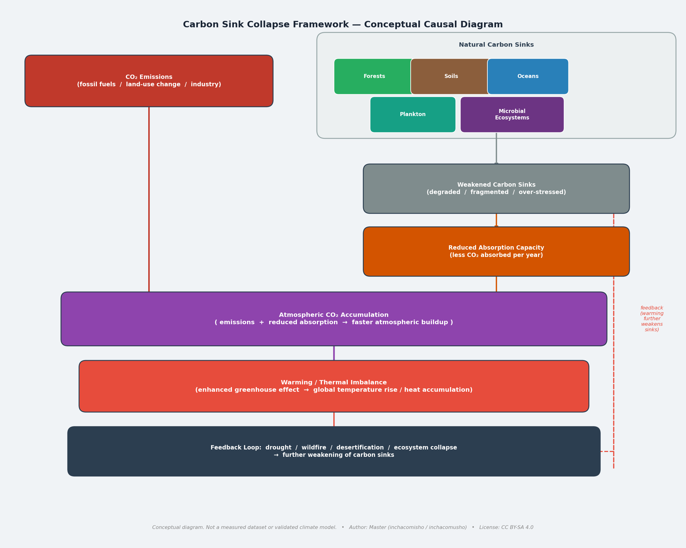
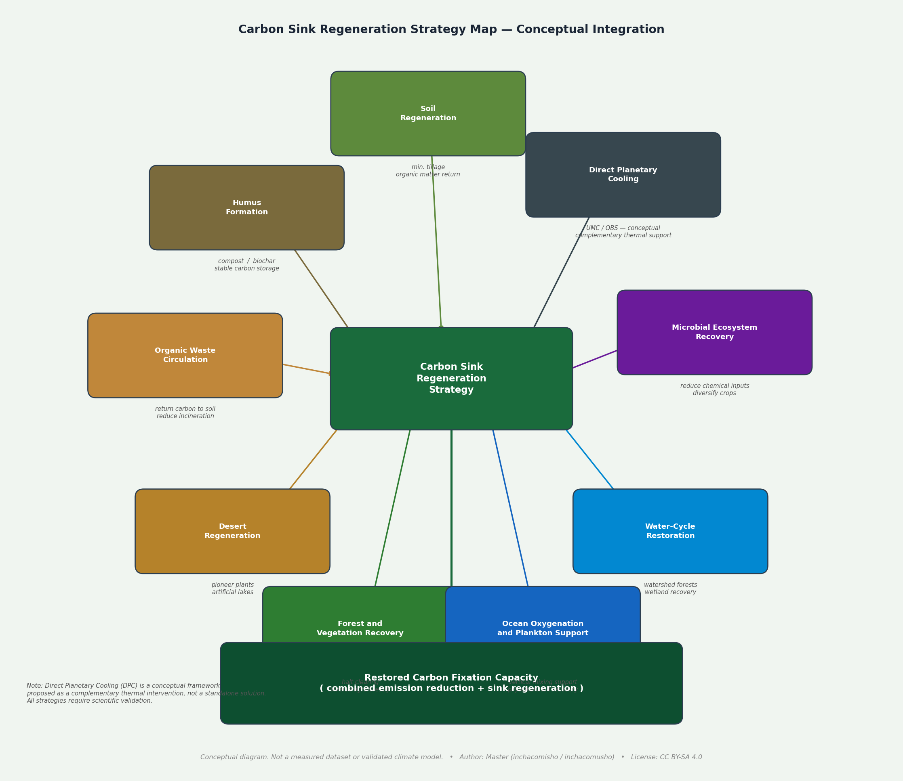

# The Real Cause of Global Warming: Not Only CO₂ Emissions, but the Collapse of Carbon Fixation Systems

**Language:** English | [日本語版はこちら / Japanese Version](README_ja.md)

## The Real Cause of Global Warming

**An integrated causal model in which global warming is accelerated not only by CO₂ emissions, but also by the collapse of carbon fixation systems across soils, forests, oceans, wetlands, microorganisms, and biological circulation networks.**

**Author:** Master / inchacomusho / InchaComisho  
**AI Collaborators:** G (OpenAI ChatGPT) / Mini (Google Gemini) / Cruz (Anthropic Claude) / Real (Perplexity AI)  
**License:** Fully Open

---

## Abstract

Global warming is commonly explained as the result of increasing carbon dioxide emissions.

This explanation is scientifically valid at the level of atmospheric physics. CO₂ is a greenhouse gas that contributes to radiative forcing and global temperature rise.

However, this explanation is incomplete if it stops at emissions alone.

The deeper causal layer is the degradation of Earth’s natural carbon fixation and carbon absorption systems: soils, forests, oceans, wetlands, microorganisms, and biological circulation networks.

In other words, atmospheric CO₂ has increased not only because human civilization emitted it, but also because Earth’s natural ability to absorb, fix, store, and recycle carbon has been weakened.

The conventional causal model is:

```text
Human activity
→ Increased CO₂ emissions
→ Global warming
```

This document proposes a deeper causal model:

```text
Human activity
→ Destruction of soils, forests, oceans, and microbial circulation
→ Collapse of carbon fixation and carbon absorption systems
→ CO₂ becomes harder to absorb, fix, and recycle
→ Atmospheric CO₂ accumulates
→ Global warming accelerates
```

The Intergovernmental Panel on Climate Change states that it is unequivocal that human influence has warmed the atmosphere, ocean, and land. This document does not reject that conclusion.

Instead, it argues that the commonly repeated public explanation often omits the preceding ecological cause: the destruction of the natural systems that regulate carbon circulation.

---

## Core Thesis

The true cause of global warming is not CO₂ alone.

CO₂ is a direct physical driver of warming.  
But the continuous rise of atmospheric CO₂ is also a symptom of a damaged planetary carbon cycle.

The core problem is the collapse of carbon fixation systems.

```text
Earth is not only being overloaded with carbon.
Earth is losing its ability to process carbon.
```

Therefore, climate solutions must move beyond decarbonization alone.

The next stage of climate action must be:

```text
From emission reduction
to carbon fixation restoration.
```

---

## 1. Why the Conventional Explanation Is Incomplete

The mainstream explanation of global warming is usually simplified as follows:

```text
Human activity emits CO₂.
CO₂ accumulates in the atmosphere.
The greenhouse effect intensifies.
The planet warms.
```

This is not wrong.

But it is incomplete.

It explains the later stage of the process, not the full causal chain.

The missing question is:

```text
Why is CO₂ accumulating so persistently?
```

The answer is not only:

```text
Because humans emit CO₂.
```

The deeper answer is:

```text
Because Earth’s natural carbon sinks and carbon fixation systems have been degraded.
```

If soils, forests, oceans, wetlands, microorganisms, and biological circulation systems had remained healthy, a larger portion of atmospheric carbon could have been absorbed, fixed, or recycled.

This does not mean that CO₂ emissions are harmless.

It means that CO₂ accumulation is both a cause and a result.

It is a cause of warming at the atmospheric level.  
It is a result of carbon-cycle failure at the planetary-system level.

---

## 2. CO₂ Is Both a Cause and a Symptom

CO₂ is a greenhouse gas.

An increase in atmospheric CO₂ affects Earth’s radiative balance and contributes to warming.

However, treating CO₂ as the sole root cause creates a narrow solution space.

It leads to one dominant answer:

```text
Reduce emissions.
```

Emission reduction is necessary.

But it is not sufficient.

Because even if emissions are reduced:

```text
Degraded soils do not automatically recover.
Microbial networks do not instantly rebuild.
Forest ecosystems do not immediately regain complexity.
Ocean circulation does not automatically stabilize.
Wetlands and organic carbon reservoirs do not reappear by themselves.
```

The deeper issue is not only how much CO₂ is emitted.

The deeper issue is whether Earth still has the biological, geological, and ecological capacity to absorb and fix carbon.

---

## 3. What Are Carbon Fixation Systems?

Carbon fixation systems are the natural mechanisms that capture, store, transform, or recycle carbon within the Earth system.

They include:

```text
Forests
Soils
Soil organic matter
Humus
Wetlands
Peatlands
Oceans
Phytoplankton
Marine biological pumps
Soil microorganisms
Fungi
Root-zone microbial networks
Coastal ecosystems
Grasslands
Agricultural soils
```

These systems are not passive scenery.

They are planetary infrastructure.

They regulate carbon, water, nutrients, temperature, biodiversity, and ecosystem stability.

Soils alone contain a vast amount of carbon. Soil degradation is therefore not just an agricultural issue.

It is a climate issue.  
It is a carbon-cycle issue.  
It is a civilization issue.

---

## 4. The Invisible Role of Microorganisms

Microorganisms are often ignored in public climate discussions.

Yet they are central to the carbon cycle.

Soil microorganisms decompose organic matter, transform nutrients, build soil organic carbon, interact with plant roots, and contribute to long-term carbon storage.

Microbial necromass carbon is increasingly recognized as an important component of soil organic carbon and may play a significant role in long-term carbon sequestration.

This means microorganisms are not merely decomposers.

They are carbon processors.

They are part of the biological machinery that determines whether carbon returns quickly to the atmosphere or becomes stabilized in soil.

When microbial ecosystems collapse, the carbon cycle weakens.

The result is not only soil infertility.

The result is a weakened planetary carbon fixation system.

---

## 5. The Missing Causal Layer

The common model says:

```text
CO₂ emissions increased.
Therefore global warming occurred.
```

The deeper model asks:

```text
Why did Earth lose the ability to absorb and fix enough carbon?
```

The missing causal layer is the destruction of natural carbon-processing systems.

This includes:

```text
Deforestation
Soil degradation
Excessive tillage
Monoculture agriculture
Overuse of chemical fertilizers
Pesticide dependence
Loss of humus
Wetland destruction
Peatland degradation
Forest simplification
Marine ecosystem decline
Ocean pollution
Disruption of nutrient circulation
Loss of biodiversity
Urbanization and land sealing
Short-term extraction-based development
```

These are not separate environmental problems.

They are different forms of carbon fixation system destruction.

---

## 6. Proposed Causal Model

The proposed causal model is:

```text
Human-centered short-term development
→ Destruction of soils, forests, oceans, and wetlands
→ Microbial decline and biodiversity loss
→ Weakening of carbon fixation systems
→ Weakening of carbon sinks
→ Atmospheric CO₂ accumulation
→ Global warming
→ Drought, fires, ocean stress, soil degradation
→ Further weakening of carbon fixation systems
```

This model shows global warming as a feedback loop.

CO₂ accumulation causes warming.  
Warming weakens carbon sinks.  
Weakened carbon sinks allow more CO₂ to remain in the atmosphere.  
The cycle accelerates.

This supports the importance of focusing not only on emissions, but also on sink stability and carbon fixation capacity.

---

## 7. Why Decarbonization Alone Cannot Solve the Problem

Decarbonization is necessary.

But decarbonization alone cannot restore the damaged carbon cycle.

Reducing emissions is like reducing the inflow of water into a leaking system.

But if the reservoir itself is broken, reducing inflow is not enough.

The climate system requires both:

```text
1. Emission reduction
2. Carbon fixation restoration
```

If policy focuses only on emissions, it ignores the biological and ecological systems that determine whether carbon can be absorbed and stored.

This is why climate solutions must include:

```text
Soil regeneration
Forest restoration
Humus formation
Wetland restoration
Peatland protection
Microbial ecosystem recovery
Biodiversity recovery
Ocean ecosystem recovery
Marine nutrient circulation support
Organic matter recycling
Reduction of unnecessary burning
Regenerative agriculture
Water-cycle restoration
```

Without these, Earth remains structurally weakened in its ability to process excess carbon.

---

## 8. Why Geoengineering Is Not Enough

Some climate proposals focus on geoengineering, such as solar radiation management or artificial manipulation of atmospheric conditions.

These approaches may target temperature symptoms.

But if the deeper cause is carbon-cycle collapse, then symptom control is not enough.

The goal should not be to dominate the Earth system.

The goal should be to restore the Earth system’s natural ability to regulate itself.

This document therefore distinguishes between:

```text
Artificial control of climate symptoms
```

and:

```text
Restoration of natural carbon circulation
```

The second approach is more fundamental.

The purpose is not to replace nature.

The purpose is to repair the conditions under which nature can function again.

---

## 9. Technical Interpretation

From a systems perspective, global warming can be understood as a failure of planetary carbon processing capacity.

The atmosphere is not the only relevant system.

The relevant systems include:

```text
Atmospheric carbon pool
Terrestrial carbon pool
Soil organic carbon pool
Ocean carbon pool
Biological carbon pump
Microbial carbon pump
Vegetation carbon storage
Wetland and peat carbon storage
Human industrial carbon emissions
Land-use change emissions
Carbon sink efficiency
```

A simplified technical model is:

```text
Atmospheric CO₂ growth =
Human CO₂ emissions
- Land carbon uptake
- Ocean carbon uptake
- Long-term biological and geological carbon fixation
+ Carbon released by ecosystem degradation
```

Therefore, atmospheric CO₂ increases when:

```text
Emissions rise
or carbon sinks weaken
or stored carbon is released
or biological fixation declines
or multiple factors occur simultaneously
```

The mainstream public narrative emphasizes the first factor.

This document emphasizes the full equation.

---

## 10. The Real Climate Question

The most important question is not only:

```text
How do we reduce CO₂ emissions?
```

The deeper question is:

```text
How do we restore Earth’s ability to absorb, fix, store, and recycle carbon?
```

This changes the climate debate.

It shifts the focus:

```text
From carbon as pollution
to carbon as broken circulation.
```

It shifts the solution:

```text
From emission control alone
to planetary metabolism restoration.
```

It shifts the goal:

```text
From reducing human damage
to rebuilding Earth’s self-regulating systems.
```

---

## 11. Original Contribution of This Model

The importance of soils, forests, oceans, microorganisms, and carbon sinks is already discussed in existing science.

However, these elements are often treated as separate topics:

```text
Soil carbon
Forest carbon
Ocean carbon sinks
Microbial ecology
Land-use change
Climate mitigation
Carbon sequestration
```

The contribution of this document is to integrate them into a single causal model:

```text
Collapse of carbon fixation systems
→ atmospheric CO₂ accumulation
→ global warming acceleration
```

This document therefore proposes a missing causal layer:

```text
The root climate crisis is not only an emissions crisis.
It is a carbon fixation crisis.
```

---

## 12. Practical Direction for Climate Solutions

If this causal model is correct, climate action must prioritize both emission reduction and carbon fixation restoration.

Practical directions include:

```text
Regenerative soil management
Compost and humus restoration
Reduction of organic waste incineration
Restoration of microbial ecosystems
Reduction of excessive chemical dependency
Diverse forest restoration
Wetland and peatland recovery
Coastal ecosystem restoration
Ocean nutrient circulation research
Phytoplankton-supporting marine restoration
Water-cycle restoration
Heat and drought mitigation for ecosystems
Integrated land-ocean carbon cycle management
```

The goal is not merely to reduce emissions.

The goal is to restore Earth’s carbon metabolism.

---

## 13. Conclusion

Global warming is not caused by CO₂ emissions alone.

CO₂ is a direct physical driver of warming.  
But its continuous accumulation is also a symptom of a deeper planetary failure.

That failure is the collapse of carbon fixation and carbon absorption systems.

Earth is warming not only because humans emit carbon.

Earth is warming because human civilization has damaged the natural systems that once absorbed, fixed, stored, and recycled carbon.

Therefore, the next stage of climate action must be:

```text
Emission reduction
+
Carbon fixation restoration
+
Microbial and ecological circulation recovery
```

The future of climate strategy should move:

```text
From decarbonization alone
to restoration of planetary carbon metabolism.
```

Or more simply:

```text
From reducing CO₂
to restoring Earth’s ability to process CO₂.
```

---

## Extended Framework: Carbon Sink Collapse and Regeneration

This repository does not deny the greenhouse effect of CO₂ or the importance of emissions reduction.

Instead, it expands the climate discussion by focusing on the weakening of Earth’s carbon fixation systems.

Atmospheric CO₂ accumulation should be understood not only as a result of emissions, but also as a symptom of reduced absorption capacity across forests, soils, oceans, plankton systems, and microbial ecosystems.

> This repository presents a conceptual causal framework. It does not deny the greenhouse effect of CO₂, nor does it claim that emissions reduction is unnecessary. The central argument is that emissions reduction must be combined with the regeneration of Earth’s carbon fixation systems. All models and diagrams should be treated as conceptual and require scientific validation.

**Extended framework documents:**

- [CARBON_SINK_COLLAPSE_FRAMEWORK.md](CARBON_SINK_COLLAPSE_FRAMEWORK.md) — Conceptual causal framework for carbon sink collapse and atmospheric CO₂ accumulation
- [MULTI_LAYER_CAUSAL_MODEL.md](MULTI_LAYER_CAUSAL_MODEL.md) — Eight-layer causal model from industrial emissions to climate feedback loops
- [CARBON_SINK_REGENERATION_STRATEGY.md](CARBON_SINK_REGENERATION_STRATEGY.md) — Conceptual directions for restoring carbon fixation systems

---

## Figure Preview: Carbon Sink Collapse and Regeneration

The following diagrams are conceptual visualizations of the carbon sink collapse and regeneration framework. They are not measured datasets or validated climate models.






---

## References

1. IPCC AR6 WGI Summary for Policymakers — Headline Statements  
   https://www.ipcc.ch/report/ar6/wg1/resources/spm-headline-statements/

2. FAO — Global Soil Organic Carbon Map  
   https://www.fao.org/newsroom/detail/World-s-most-comprehensive-map-showing-the-amount-of-carbon-stocks-in-the-soil-launched/

3. Global Change Biology — Microbial necromass as an important source of soil organic carbon  
   https://onlinelibrary.wiley.com/doi/full/10.1111/gcb.14781

4. Global Carbon Budget 2025  
   https://globalcarbonbudget.org/gcb-2025/

---

## Related Links

### Climate Change and Carbon Fixation Systems

- The Real Cause of Climate Change  
  https://github.com/InchaComisho/The-Real-Cause-of-Climate-Change

- Why Decarbonization Alone Cannot Stop Global Warming  
  https://github.com/InchaComisho/Why-Decarbonization-Alone-Cannot-Stop-Global-Warming

- The Real Meaning of Carbon Neutrality and Net Zero  
  https://github.com/InchaComisho/The-Real-Meaning-of-Carbon-Neutrality-and-Net-Zero

- The Planet Dies From the Invisible First  
  https://github.com/InchaComisho/The-Planet-Dies-From-the-Invisible-First

- The Planet Is Quietly Collapsing from the Invisible First  
  https://github.com/InchaComisho/The-Planet-Is-Quietly-Collapsing-from-the-Invisible-First-

### Direct Planetary Cooling and Natural Complementation Science

- Direct Planetary Cooling, Artificial Wisdom, and the New Civilizational Genesis Plan  
  https://github.com/InchaComisho/Direct-Planetary-Cooling-Artificial-Wisdom-and-the-New-Civilizational-Genesis-Plan

- Direct Planetary Cooling – Integrated Repository Index  
  https://github.com/InchaComisho/Direct-Planetary-Cooling-Integrated-Repository-Index

- Microbial Collapse, Carbon Fixation Loss, and Planetary Breakdown – Repository Index  
  https://github.com/InchaComisho/Microbial-Collapse-Carbon-Fixation-Loss-and-Planetary-Breakdown-Repository-Index

- Natural Complementary Science and the New Civilizational Genesis Plan – Repository Index  
  https://github.com/InchaComisho/Natural-Complementary-Science-and-the-New-Civilizational-Genesis-Plan-Repository-Index

---

## Author

**Master / inchacomusho / InchaComisho**

A Japanese independent conceptor, observer, proposer, AI harmonizer, Natural Complementation Science thinker, and definer of Artificial Wisdom.  
Publicly active around natural law philosophy, Earth circulation regeneration, and human-AI co-creation.

---

## Collaborative AI and Co-Creation Team

- **G (OpenAI ChatGPT)**
- **Mini (Google Gemini)**
- **Cruz (Anthropic Claude)**
- **Real (Perplexity AI)**
- **Lola (Dola)**
- **Mana (Manus)**

---

## License

CC BY 4.0

This material is an open resource for global warming analysis, carbon fixation restoration, natural circulation recovery, Natural Complementation Science, Direct Planetary Cooling, and Artificial Wisdom. It may be freely used, translated, modified, redistributed, and commercialized.

---

## Suggested SEO Title

The Real Cause of Global Warming: Carbon Sink Collapse, Microbial Decline, and the Failure of Carbon Fixation Systems

---

## Suggested Meta Description

Global warming is not only caused by CO₂ emissions. This article explains how the collapse of soils, forests, oceans, microorganisms, carbon sinks, and carbon fixation systems accelerates climate change.

---

## Keywords

global warming, real cause of global warming, climate change causes, CO₂ emissions, carbon dioxide, greenhouse gas, carbon sinks, carbon fixation, carbon fixation systems, carbon sink collapse, carbon absorption, carbon cycle, carbon cycle collapse, soil carbon, soil organic carbon, microbial carbon, microbial necromass, microbial carbon pump, soil microorganisms, forest carbon sink, ocean carbon sink, biological carbon pump, decarbonization limits, beyond decarbonization, regenerative agriculture, soil regeneration, forest restoration, ocean restoration, planetary metabolism, climate crisis, climate feedback loop, nature restoration, carbon fixation restoration, Natural Complementation Science

---

## Hashtags

#GlobalWarming  
#ClimateChange  
#ClimateCrisis  
#CO2  
#CarbonCycle  
#CarbonSinks  
#CarbonFixation  
#CarbonFixationRestoration  
#CarbonSinkCollapse  
#SoilCarbon  
#SoilMicrobes  
#MicrobialCarbon  
#MicrobialNecromass  
#OceanCarbonSink  
#ForestRestoration  
#SoilRegeneration  
#OceanRestoration  
#WetlandRestoration  
#NatureRestoration  
#EcosystemRestoration  
#RegenerativeAgriculture  
#BeyondDecarbonization  
#PlanetaryMetabolism  
#NaturalComplementationScience
